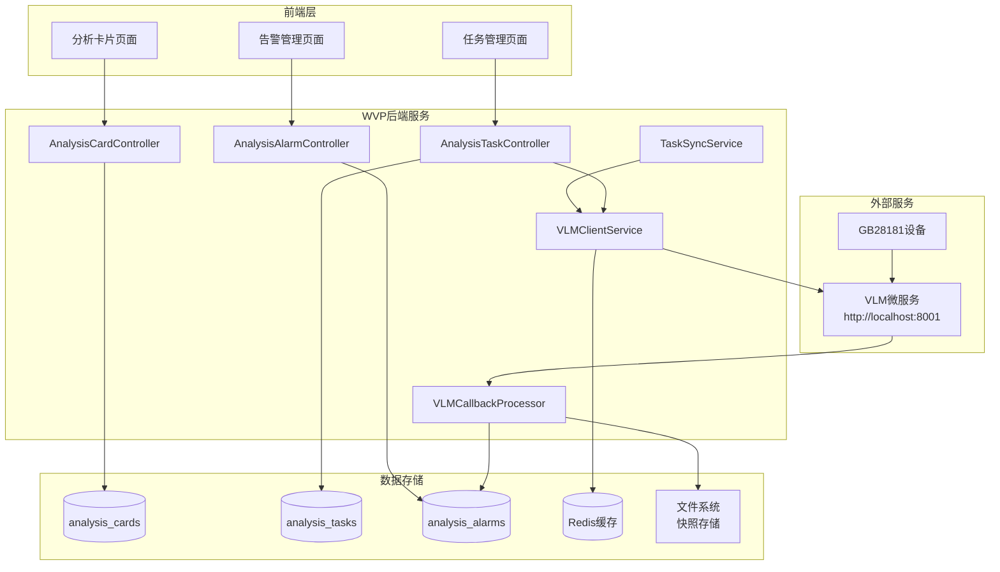
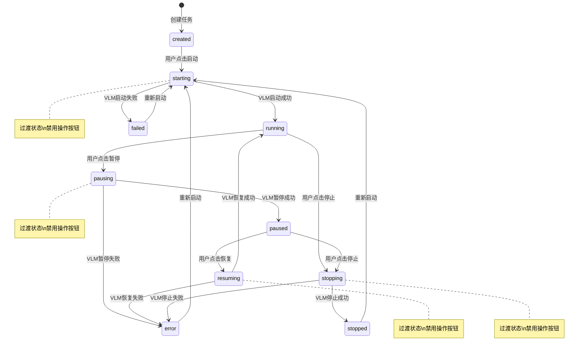

# WVP智能分析模块集成设计文档

## 概述

本设计文档详细描述了WVP智能分析模块的技术架构和实现方案。该模块将在现有WVP-GB28181-pro平台基础上集成VLM-Engine智能分析微服务，实现视频流的实时智能分析、告警管理和可视化展示。

设计遵循WVP现有的技术栈和架构模式，确保与现有系统的无缝集成，同时提供高可用性、可扩展性和良好的用户体验。

## 架构

### 系统架构图



### 集成架构

**分层架构：**
1. **表现层（Presentation Layer）**：Vue.js + Element UI前端界面
2. **控制层（Controller Layer）**：Spring Boot REST API控制器
3. **服务层（Service Layer）**：业务逻辑处理和外部服务集成
4. **数据访问层（Data Access Layer）**：MyBatis数据访问和Redis缓存
5. **存储层（Storage Layer）**：MySQL数据库和文件系统

**集成方式：**
- **同步集成**：WVP主动调用VLM微服务API进行作业管理
- **异步回调**：VLM微服务通过HTTP回调向WVP推送分析结果
- **定时同步**：定期同步任务状态确保数据一致性

### 任务状态生命周期



## 组件和接口

### 前端组件架构

```mermaid
graph TB
    subgraph "路由模块"
        R1[/analysis]
        R2[/analysis/cards]
        R3[/analysis/tasks] 
        R4[/analysis/alarms]
    end
    
    subgraph "页面组件"
        P1[AnalysisCards.vue]
        P2[AnalysisTasks.vue]
        P3[AnalysisAlarms.vue]
    end
    
    subgraph "子组件"
        C1[CardItem.vue<br/>卡片项]
        C2[CardEditor.vue<br/>卡片编辑器]
        C3[TaskForm.vue<br/>任务表单]
        C4[DeviceChannelSelector.vue<br/>设备通道选择器]
        C5[AlarmItem.vue<br/>告警项]
        C6[AlarmDetail.vue<br/>告警详情]
    end
    
    subgraph "共享服务"
        S1[analysisAPI.js<br/>API接口]
        S2[webSocketService.js<br/>WebSocket服务]
    end
    
    R2 --> P1
    R3 --> P2
    R4 --> P3
    
    P1 --> C1
    P1 --> C2
    P2 --> C3
    P2 --> C4
    P3 --> C5
    P3 --> C6
    
    P1 --> S1
    P2 --> S1
    P3 --> S1
    P3 --> S2
```

### 后端组件设计

**1. Controller层组件**

```java
@RestController
@RequestMapping("/api/analysis")
public class AnalysisBaseController {
    // 基础控制器，包含通用验证和异常处理
}

@RestController
@RequestMapping("/api/analysis/cards")
public class AnalysisCardController extends AnalysisBaseController {
    // 分析卡片管理接口
}

@RestController  
@RequestMapping("/api/analysis/tasks")
public class AnalysisTaskController extends AnalysisBaseController {
    // 分析任务管理接口
}

@RestController
@RequestMapping("/api/analysis/alarms") 
public class AnalysisAlarmController extends AnalysisBaseController {
    // 告警管理接口和VLM回调接收
}
```

**2. Service层组件**

```java
@Service
public class AnalysisCardService {
    // 分析卡片业务逻辑
}

@Service
public class AnalysisTaskService {
    // 任务管理业务逻辑，包含VLM集成
}

@Service
public class AnalysisAlarmService {
    // 告警处理业务逻辑
}

@Service
public class VLMClientService {
    // VLM微服务客户端封装
}

@Component
public class VLMCallbackProcessor {
    // VLM回调数据处理器（异步）
}

@Service
public class TaskSyncService {
    // 任务状态同步服务（定时任务）
}
```

### 关键接口定义

**1. VLM微服务集成接口**

```java
public interface VLMService {
    VLMJobResponse createJob(VLMJobRequest request, boolean autoStart);
    VLMJobActionResponse startJob(String jobId, boolean forceRestart);
    VLMJobActionResponse pauseJob(String jobId);
    VLMJobActionResponse resumeJob(String jobId);
    VLMJobCancelResponse stopJob(String jobId);
    VLMJobStatusResponse getJobStatus(String jobId);
    VLMHealthResponse checkHealth();
}
```

**2. 告警处理接口**

```java
public interface AlarmProcessingService {
    void processVLMCallback(VLMAnalysisResult callback);
    void createAlarmFromEvent(AnalysisTask task, Event event, VLMAnalysisResult callback);
    String saveSnapshotImage(String base64Data);
}
```

**3. 任务状态管理接口**

```java
public interface TaskStateService {
    void startTask(String taskId, boolean forceRestart);
    void pauseTask(String taskId);
    void resumeTask(String taskId);
    void stopTask(String taskId);
    void syncTaskStatus(String taskId);
    void syncAllTaskStatuses();
    TaskStatus getTaskStatus(String taskId);
    boolean canPerformAction(String taskId, TaskAction action);
}

public enum TaskAction {
    START, PAUSE, RESUME, STOP
}
```

**4. WebSocket推送接口**

```java
public interface WebSocketAlarmService {
    void sendAlarmNotification(AnalysisAlarm alarm);
    void sendTaskStatusUpdate(AnalysisTask task);
}
```

## 数据模型

### 数据库设计

**1. 分析卡片表（analysis_cards）**
```sql
CREATE TABLE analysis_cards (
    id VARCHAR(50) PRIMARY KEY,
    title VARCHAR(100) NOT NULL COMMENT '卡片标题',
    description TEXT COMMENT '卡片描述',
    icon VARCHAR(200) COMMENT '卡片图标URL',
    tags JSON COMMENT '标签数组',
    enabled BOOLEAN DEFAULT TRUE COMMENT '是否启用',
    prompt TEXT NOT NULL COMMENT '分析提示词',
    model_type VARCHAR(50) DEFAULT 'videollama3' COMMENT '模型类型',
    analysis_config JSON COMMENT 'VLM分析配置参数',
    created_by VARCHAR(50) COMMENT '创建人',
    created_at TIMESTAMP DEFAULT CURRENT_TIMESTAMP,
    updated_at TIMESTAMP DEFAULT CURRENT_TIMESTAMP ON UPDATE CURRENT_TIMESTAMP,
    INDEX idx_enabled (enabled),
    INDEX idx_created_by (created_by)
);
```

**2. 分析任务表（analysis_tasks）**
```sql
CREATE TABLE analysis_tasks (
    id VARCHAR(50) PRIMARY KEY,
    task_name VARCHAR(100) NOT NULL COMMENT '任务名称',
    analysis_card_id VARCHAR(50) NOT NULL COMMENT '分析卡片ID',
    device_id VARCHAR(50) NOT NULL COMMENT '设备ID',
    device_name VARCHAR(100) COMMENT '设备名称',
    channel_id VARCHAR(50) NOT NULL COMMENT '通道ID',
    channel_name VARCHAR(100) COMMENT '通道名称',
    rtsp_url VARCHAR(500) COMMENT 'RTSP流地址',
    status ENUM('created', 'starting', 'running', 'pausing', 'paused', 'resuming', 'stopping', 'stopped', 'failed', 'error') DEFAULT 'created',
    vlm_job_id VARCHAR(50) COMMENT 'VLM微服务Job ID',
    config JSON COMMENT '任务配置参数',
    error_message TEXT COMMENT '错误信息',
    last_active_time TIMESTAMP COMMENT '最后活跃时间',
    last_status_sync TIMESTAMP COMMENT '最后状态同步时间',
    created_by VARCHAR(50) COMMENT '创建人',
    created_at TIMESTAMP DEFAULT CURRENT_TIMESTAMP,
    updated_at TIMESTAMP DEFAULT CURRENT_TIMESTAMP ON UPDATE CURRENT_TIMESTAMP,
    FOREIGN KEY (analysis_card_id) REFERENCES analysis_cards(id),
    INDEX idx_device_channel (device_id, channel_id),
    INDEX idx_status (status),
    INDEX idx_vlm_job_id (vlm_job_id),
    INDEX idx_last_status_sync (last_status_sync),
    UNIQUE KEY uk_device_channel_card (device_id, channel_id, analysis_card_id)
);
```

**3. 分析告警表（analysis_alarms）**
```sql
CREATE TABLE analysis_alarms (
    id VARCHAR(50) PRIMARY KEY,
    task_id VARCHAR(50) NOT NULL COMMENT '任务ID',
    device_id VARCHAR(50) NOT NULL COMMENT '设备ID',
    device_name VARCHAR(100) COMMENT '设备名称',
    channel_id VARCHAR(50) NOT NULL COMMENT '通道ID',
    channel_name VARCHAR(100) COMMENT '通道名称',
    analysis_type VARCHAR(50) COMMENT '分析类型',
    description TEXT COMMENT '告警描述',
    snapshot_path VARCHAR(500) COMMENT '快照图片路径',
    alarm_time TIMESTAMP NOT NULL COMMENT '告警时间',
    event_start_time TIMESTAMP COMMENT '事件开始时间',
    event_end_time TIMESTAMP COMMENT '事件结束时间',
    event_time_range VARCHAR(50) COMMENT '相对时间范围',
    video_window_info JSON COMMENT '视频窗口时间信息',
    status ENUM('pending', 'processing', 'resolved', 'ignored') DEFAULT 'pending',
    created_at TIMESTAMP DEFAULT CURRENT_TIMESTAMP,
    FOREIGN KEY (task_id) REFERENCES analysis_tasks(id),
    INDEX idx_task_time (task_id, alarm_time),
    INDEX idx_device_time (device_id, alarm_time),
    INDEX idx_status (status)
);
```

### 领域模型

**1. Java实体类设计**

```java
@Data
public class AnalysisCard {
    private String id;
    private String title;
    private String description;
    private String icon;
    private List<String> tags;
    private Boolean enabled;
    private String prompt;
    private String modelType;
    private AnalysisConfig analysisConfig;
    private String createdBy;
    private LocalDateTime createdAt;
    private LocalDateTime updatedAt;
}

@Data
public class AnalysisTask {
    private String id;
    private String taskName;
    private String analysisCardId;
    private String deviceId;
    private String deviceName;
    private String channelId;
    private String channelName;
    private String rtspUrl;
    private TaskStatus status;
    private String vlmJobId;
    private Map<String, Object> config;
    private String errorMessage;
    private LocalDateTime lastActiveTime;
    private LocalDateTime lastStatusSync;
    private String createdBy;
    private LocalDateTime createdAt;
    private LocalDateTime updatedAt;
    
    // 任务状态枚举
    public enum TaskStatus {
        CREATED,     // 已创建
        STARTING,    // 启动中
        RUNNING,     // 运行中
        PAUSING,     // 暂停中
        PAUSED,      // 已暂停
        RESUMING,    // 恢复中
        STOPPING,    // 停止中
        STOPPED,     // 已停止
        FAILED,      // 失败
        ERROR        // 错误
    }
    
    // 状态转换辅助方法
    public boolean isTransitioning() {
        return status == TaskStatus.STARTING || 
               status == TaskStatus.PAUSING || 
               status == TaskStatus.RESUMING || 
               status == TaskStatus.STOPPING;
    }
    
    public boolean canStart() {
        return status == TaskStatus.CREATED || status == TaskStatus.STOPPED;
    }
    
    public boolean canPause() {
        return status == TaskStatus.RUNNING;
    }
    
    public boolean canResume() {
        return status == TaskStatus.PAUSED;
    }
    
    public boolean canStop() {
        return status == TaskStatus.RUNNING || status == TaskStatus.PAUSED;
    }
}

@Data
public class AnalysisAlarm {
    private String id;
    private String taskId;
    private String deviceId;
    private String deviceName;
    private String channelId;
    private String channelName;
    private String analysisType;
    private String description;
    private String snapshotPath;
    private LocalDateTime alarmTime;
    private LocalDateTime eventStartTime;
    private LocalDateTime eventEndTime;
    private String eventTimeRange;
    private VideoWindowInfo videoWindowInfo;
    private AlarmStatus status;
    private LocalDateTime createdAt;
}
```

**2. VLM集成数据模型**

```java
@Data
public class VLMJobRequest {
    private String deviceId;
    private String channelId;
    private String inputType = "rtsp_stream";
    private String inputData;
    private String callbackUrl;
    private AnalysisConfig analysisConfig;
    private String analysisPrompt;
    private String modelName;
}

@Data
public class VLMAnalysisResult {
    private String jobId;
    private String deviceId;
    private String channelId;
    private String analysisTimestampUtc;
    private VideoWindow videoWindow;
    private List<Event> events;
}

@Data
public class Event {
    private Double eventStartPts;
    private Double eventEndPts;
    private String eventStartUtc;
    private String eventEndUtc;
    private String eventTimeRange;
    private String eventDescription;
    private Boolean emergencyExist;
    private String snapshotBase64;
}

@Data
public class VLMJobActionResponse {
    private String jobId;              // 任务ID
    private String previousStatus;     // 操作前状态
    private String currentStatus;      // 操作后状态
    private String message;            // 操作结果消息
    private LocalDateTime actionTimestamp; // 操作时间
}
```

## 错误处理

### 异常处理策略

**1. 分层异常处理**

```java
// 业务异常
public class AnalysisBusinessException extends RuntimeException {
    private String errorCode;
    private String message;
}

// VLM集成异常
public class VLMIntegrationException extends RuntimeException {
    private String vlmErrorCode;
    private String vlmMessage;
}

// 全局异常处理器
@RestControllerAdvice
public class AnalysisExceptionHandler {
    
    @ExceptionHandler(AnalysisBusinessException.class)
    public WVPResult<Void> handleBusinessException(AnalysisBusinessException e) {
        return WVPResult.fail(e.getErrorCode(), e.getMessage());
    }
    
    @ExceptionHandler(VLMIntegrationException.class) 
    public WVPResult<Void> handleVLMException(VLMIntegrationException e) {
        return WVPResult.fail(ErrorCode.VLM_SERVICE_ERROR, "VLM服务异常: " + e.getMessage());
    }
}
```

**2. 错误码定义**

```java
public class AnalysisErrorCode {
    public static final String CARD_NOT_FOUND = "ANALYSIS_001";
    public static final String TASK_NOT_FOUND = "ANALYSIS_002";  
    public static final String VLM_SERVICE_ERROR = "ANALYSIS_003";
    public static final String DEVICE_CHANNEL_INVALID = "ANALYSIS_004";
    public static final String TASK_STATE_INVALID = "ANALYSIS_005";
    public static final String TASK_ALREADY_TRANSITIONING = "ANALYSIS_006";
    public static final String VLM_JOB_NOT_FOUND = "ANALYSIS_007";
    public static final String CALLBACK_DATA_INVALID = "ANALYSIS_008";
    public static final String TASK_ACTION_NOT_ALLOWED = "ANALYSIS_009";
}
```

### 容错机制

**1. VLM服务故障处理**
- 连接超时：30秒超时，自动重试3次
- 服务不可用：标记任务为error状态，发送告警
- 网络波动：指数退避重试策略

**2. 任务状态管理容错**
- 状态转换失败：回滚到前一个稳定状态
- 过渡状态超时：30秒后自动标记为error状态
- 状态不一致：提供手动同步功能
- 并发操作冲突：使用乐观锁防止状态冲突

**3. 回调处理容错**
- 数据验证失败：记录日志，不影响其他回调处理
- 处理异常：异步重试机制，最多重试3次
- 快照存储失败：仍然创建告警记录，快照路径为空

**3. 数据一致性保障**
- 任务状态同步：定期校验VLM侧和WVP侧状态
- 事务性操作：关键业务操作使用数据库事务
- 补偿机制：提供手动同步和修复工具

## 测试策略

### 单元测试

**1. Service层测试覆盖**
```java
@SpringBootTest
class AnalysisCardServiceTest {
    @Test
    void testCreateCard() {
        // 测试卡片创建逻辑
    }
    
    @Test 
    void testValidateCardData() {
        // 测试数据验证逻辑
    }
}

@SpringBootTest
class TaskStateServiceTest {
    @Test
    void testTaskStateTransitions() {
        // 测试各种状态转换场景
    }
    
    @Test 
    void testTaskActionValidation() {
        // 测试操作权限验证
    }
    
    @Test
    void testConcurrentStateChanges() {
        // 测试并发状态变更场景
    }
}

@SpringBootTest
class VLMClientServiceTest {
    @Test
    void testCreateJobSuccess() {
        // 测试VLM作业创建成功场景
    }
    
    @Test
    void testCreateJobFailure() {
        // 测试VLM作业创建失败场景
    }
}
```

**2. Mock外部依赖**
```java
@MockBean
private VLMClientService vlmClientService;

@Test
void testTaskEnableWhenVLMSuccess() {
    when(vlmClientService.createJob(any()))
        .thenReturn(new VLMJobResponse("job-123", "pending", "Job created"));
    
    // 测试任务启用成功场景
}
```

### 集成测试

**1. API接口测试**
```java
@SpringBootTest
@AutoConfigureTestDatabase
class AnalysisControllerIntegrationTest {
    
    @Test
    void testCreateCardEndToEnd() {
        // 端到端测试卡片创建流程
    }
    
    @Test
    void testVLMCallbackHandling() {
        // 测试VLM回调处理完整流程
    }
}
```

**2. 数据库集成测试**
```java
@DataJpaTest
class AnalysisTaskRepositoryTest {
    
    @Test
    void testFindByDeviceAndChannel() {
        // 测试数据库查询功能
    }
}
```

### 性能测试

**1. 回调处理性能测试**
- 并发回调处理能力测试
- 大量告警数据写入性能测试
- 快照图片存储性能测试

**2. 前端组件性能测试**
- 卡片列表渲染性能（1000+卡片）
- 任务列表分页加载性能
- 告警实时推送性能

### 端到端测试

**1. 用户场景测试**
```javascript
// Cypress端到端测试示例
describe('智能分析模块', () => {
  it('创建分析任务完整流程', () => {
    cy.visit('/analysis/cards')
    cy.get('[data-cy=create-card]').click()
    cy.get('[data-cy=card-title]').type('火灾检测')
    cy.get('[data-cy=save-card]').click()
    
    cy.visit('/analysis/tasks')
    cy.get('[data-cy=create-task]').click()
    // ... 测试完整的任务创建流程
  })
})
```

**2. VLM集成测试**
- 模拟VLM服务响应测试
- 回调数据处理测试
- 故障场景恢复测试

这个设计文档提供了完整的技术架构方案，包含详细的组件设计、数据模型、错误处理策略和全面的测试策略。设计遵循WVP现有的技术栈和架构模式，确保系统的可维护性和扩展性。